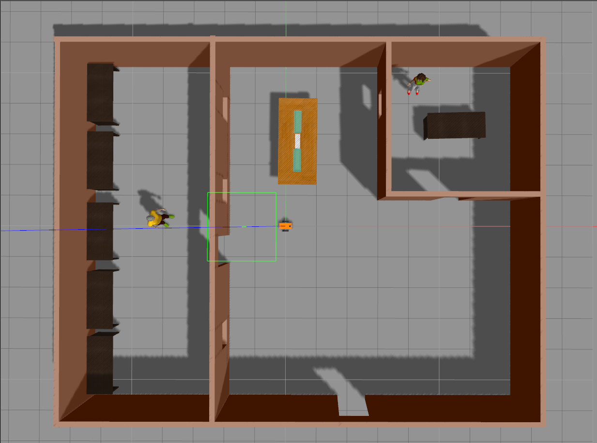
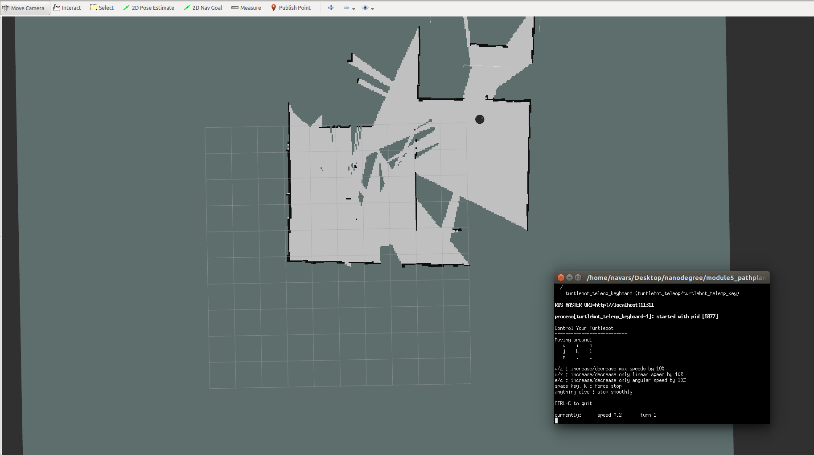
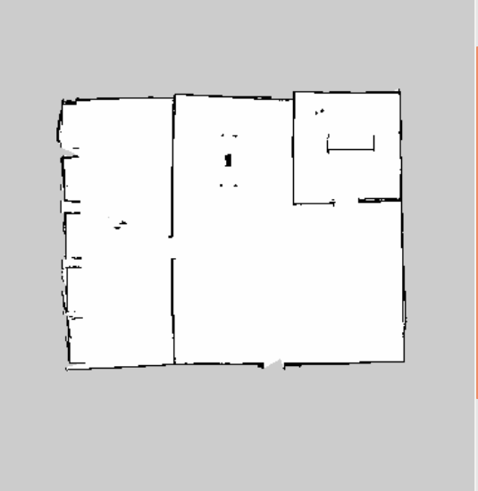
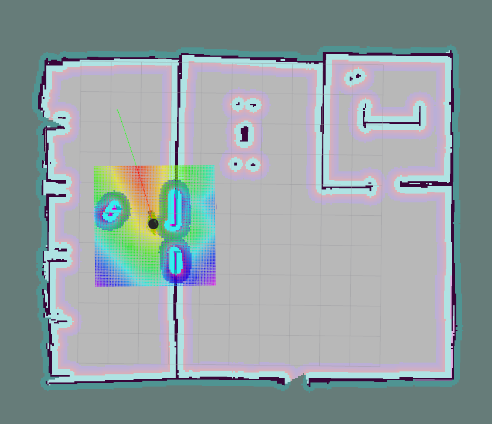
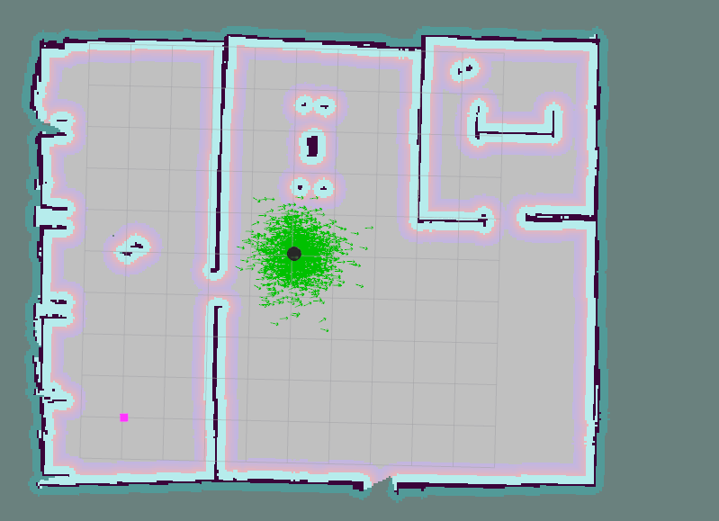

# Robotics Nanodegree - Home Service Robot 

This is my Udacity's Robotics Nanodegree final project ```Home Service Robot```.

### Requirements
For this project, the following packages are required:
- [gmapping](http://wiki.ros.org/gmapping): Used to create a map of the world in ```catkin_ws/src/map```.
- [turtlebot_teleop](http://wiki.ros.org/turtlebot_teleop): Used to move the robot while mapping the world using the keyboard.
- [turtlebot_rviz_launchers](http://wiki.ros.org/turtlebot_rviz_launchers): Used to launch pre-configured Rviz workspaces.
- [turtlebot_gazebo](http://wiki.ros.org/turtlebot_gazebo): Deploys a turtlebot in Gazebo. 

### Build project
Initialize workspace:
```
	cd /path/to/catkin_ws/src/
	catkin_init_workspace
```

To compile:
```
	cd /path/to/catkin_ws/
	catkin_make
```

## Scripts
Note: on the scripts, I set a couple of variables with my custom paths. Make sure these variables match your paths:
- TURTLEBOT_GAZEBO_WORLD_FILE
- TURTLEBOT_GAZEBO_MAP_FILE

### Test SLAM
Deploys a turtlebot inside an environment found in ```catkin_ws/src/map```, and control it with the keyboard to map the environment. 

To run the script:
```
	cd /path/to/catkin_ws/
	./src/scripts/test_slam.zsh
```

Gazebo world should look like this:
<p align="center"></p>

Rviz-SLAM should look like this:
<p align="center"></p> 

Output map:
<p align="center"></p> 

### Test navigation 
Tests the ROS navigation stack. Add a goal location on RVIZ using the 2D Nav Goal and test if the robot moves toward it and orients itself correctly. 

To run the script:
```
	cd /path/to/catkin_ws/
	./src/scripts/test_navigation.zsh
```

Rviz-Navigation should look like this:
<p align="center"></p> 

### Pick Objects
This is a node that sends multiple goals to the ROS Navigation stack based on [this](http://wiki.ros.org/navigation/Tutorials/SendingSimpleGoals) tutorial. 

It also implements a simple location publisher to a topic named ```/location_home_service``` to inform if it is at ```PICKUP```, ```DROPOFF```, ```HOME``` or ```UNKOWN``` location. 

It starts by going to a ```PICKUP``` location. Then, it waits 5 seconds (simulating an object being picked-up). Then, it goes to a ```DROPOFF``` location. And finally, returns to ```HOME``` location. 

To run the script:
```
	cd /path/to/catkin_ws/
	./src/scripts/pick_objects.zsh
```

### Add Markers
This are two nodes that model a virtual object being picked up from a starting and dropped off to a goal location:
- ```add_markers_test```: Starts by publishing a marker at ```PICKUP``` location. Then, it hides the marker for 5 seconds (simulating an object being carried to a goal location). Then, it publishes the marker at ```DROPOFF``` location.

To run the script:
```
	cd /path/to/catkin_ws/
	./src/scripts/add_markers.zsh
```

Rviz with a marker near the bottom-left corner of the map:
<p align="center"></p> 

- ```add_markers```: Subscribes to the ```/location_home_service``` topic to listen to the current status of the robot. Then it publishes or hides the marker depending on such status. This node is used on the ```home_service_robot``` script. 


### Home Service Robot
This integrates all the nodes that perform visualization and navigation. It simulates a robot picking up an object at a ```PICKUP``` location and leaves it at ```DROPOFF```. It uses the ```pick_objects``` node to go these locations, and it publishes its status to the topic  ```/location_home_service```. 

The object being picked-up and dropped-off is represented as a marker in Rviz. It uses the ```add_markers``` node to subscribe to the ```/location_home_service``` and publish a marker depending on the robot status. 

When the robot is done, it returns to its ```HOME``` location. 

To run the script:
```
	cd /path/to/catkin_ws/
	./src/scripts/home_service_robot.zsh
```